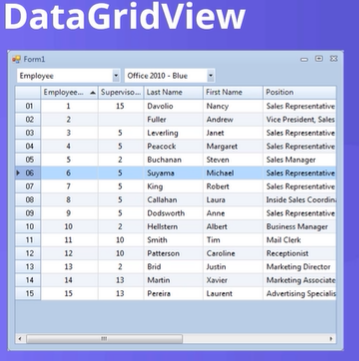

Arrays in c#

use brackets

arrays start from zero.

//Defining an array in c# (syntax)
-----------------------------------------
datatype[] name;
-----------------------------------------

//Examples of declaring arrays with differnt datatypes and names

-----------------------------------------
int[]ages;

string[] names;

double[] costs;
-----------------------------------------

ways to set up arrays
-----------------------------------------
int[] numbers = new int [4];

int[] numbers2 = new int[4]{3, 4, 5, 6};
int[] numbers3 = new int[]{3, 4, 5, 6};
int[] numbers4 = {3, 4, 5, 6};
int[] numbers5;
numbers5 = new int[4]{3, 4, 5, 6};

-----------------------------------------

1. Assigning values to array
---------------------------------
int[] numbers = new int [4]; // sets how number of index in array; 0, 1, 2, 3 
numbers[0] = 3;
numbers[1] = 4;
numbers[2] = 5;
numbers[3] = 6;

// setting up a new variable that has a value equal to array index 0 above
// so it's value will be 3 in this case
int numbers1value = numbers[0]

---------------------------------

2. Assigning values to array - with **FOR loop**
---------------------------------
string[] days; // declaring empty array
days = new string[]{// giving the array values at each index starting from 0 index
    "Sunday",
    "Monday",
    "Tuseday",
    "Wednesday",
    "Thursday",
    "Friday",
    "Saturday"

};

for(int i =0; i < days.Length; i++) // cycles trhough days array and spits out each day
{
    textvalue =+ days[i] + " " + Environment.NewLine;
}
txtDays.Text = textvalue;

---------------------------------

2.1 Assigning values to array - with **FOREACH loop** 
---------------------------------
string[] days; // declaring empty array
days = new string[]{// giving the array values at each index starting from 0 index
    "Sunday",
    "Monday",
    "Tuseday",
    "Wednesday",
    "Thursday",
    "Friday",
    "Saturday"

};

foreach(string item in days) 
{
    textvalue =+ item + " " + Environment.NewLine;
}
txtDays.Text = textvalue;

---------------------------------

multidimensional arrays (**rectangular array in c#**)
ways of declaring rectangular arrays in c #
---------------------------------------------------
※※nested loop required for multi demnsional arrays / rectangular arrays
int[,] array2D = new int[5, 4];

int[,,] array2D = new int[5, 4, 3];

int[][] array2d ={new int[4]{3, 4, 5, 6},
new int[]{6, 7, 8, 9}};

---------------------------------------------------

multidimensional array/ rectangular array nested for loop accesing data
---------------------------------------------------
int[][] array2d ={new int[]{1, 2, 3, 4, 5},
new int[]{6, 7, 8, 9}};

// below is nested array for accessing data in a 2d array
for (int i = 0; i < array2d.Length; i++)
{
    for(int j = 0; j < array2d[i].Length; j++)
    {

    }
}

---------------------------------------------------

.NET element - DataGridView
---------------------------------------------------
allows us to display data in a tabular format!

---------------------------------------------------

DataGridView Button that lets you add all items of an array the data grid view:

--------------------------------------------------------------------------

        private void button1_Click(object sender, EventArgs e)
        {
            string[] days = new string[7];
            days[0] = "Sunday";
            days[1] = "Monday";
            days[2] = "Tuseday";
            days[3] = "Wednesday";
            days[4] = "Thursday";
            days[5] = "Friday";
            days[6] = "Saturday";
            for (int i = 0; i < days.Length; i++)
            {
                string rowtext = days[i];
                dataGridView1.Rows.Add(rowtext);
            }

        }

--------------------------------------------------------------------------

Alternate closer to how javascript arrays are made version
※this feels easier
--------------------------------------------------------------------------
        private void button1_Click(object sender, EventArgs e)
        {
            string[] days = new string[]
            {
                "Sunday",
                "Monday",
                "Tuseday",
                "Wednesday",
                "Thursday",
                "Friday",
                "Saturday"
            };
           
            for (int i = 0; i < days.Length; i++)
            {
                string rowtext = days[i];
                dataGridView1.Rows.Add(rowtext);
            }

        }
--------------------------------------------------------------------------