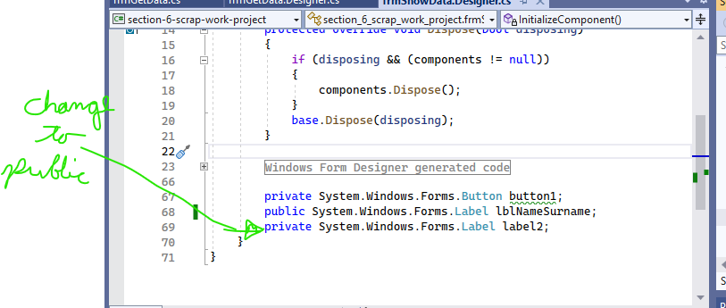
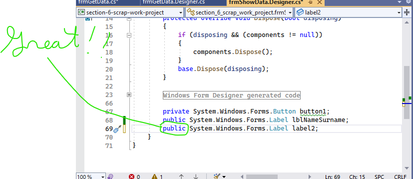

switch and data transfer between forms

1. Button Click event that lets opens another form on click
- you can use them together
-differnence ".Show"
--------------------------------------------------------------------
        private void button1_Click(object sender, EventArgs e)
        {
            //making a class instance of fromShowData form
            // this must be done casue the form use make is only a class
            // and you only want the instance of the form affected by changes
            // NOT the actual form class itself
            frmShowData frmShow = new frmShowData();
            //showing the other form on click
            frmShow.Show();
        }
--------------------------------------------------------------------

2. Button Click event that lets opens another form on click
- only can use the open form and the first form won't be usable
-difference? ".ShowDialog"
--------------------------------------------------------------------
        private void button1_Click(object sender, EventArgs e)
        {

            //making a class instance of fromShowData form
            frmShowData frmShow = new frmShowData();
            //showing the other form on click
            frmShow.ShowDialog();

        }
--------------------------------------------------------------------

**DATA TRANSFER EXAMPLE**

before doing the code below, you have to go to the form you plan on opening
and make the label where you want the input text on the current form to show, public (it is nativly private)

1st - go to solution explorer and click

2nd - scroll down and change from "private" to "public"
- makes this  "label" (in this case) accessible anywhere in the project where it would have only been accessible to the form on which it was created

3rd - do this bit below on the first form (the form you will do the date)
-make the buttons and texts boxes for it in the form THEN do the below:
--------------------------------------------------------------------

        private void button3_Click(object sender, EventArgs e)
        {
            string Name =textName.Text;
            string surename = textSurname.Text;
            string NameSurname = Name + " " +surename;
            frmShowData frmShow = new frmShowData();
            frmShow.lblNameSurname.Text = NameSurname;
            frmShow.Show();

        }

--------------------------------------------------------------------